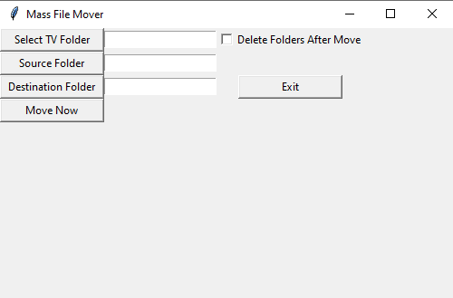

# FileMover

This project is mostly to help me move around files easier and with less hassle.

At the moment it can go into each folder within a folder of your choosing and find the largest file then move that else where.
It also allows you to delete the folder that the file came out of after the move has been completed so no need to go delete the folders yourself after the files have been moved.

